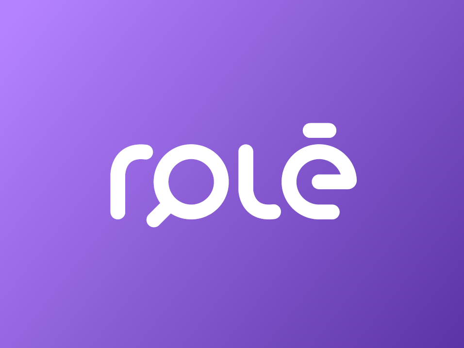

# chefao-final-backend <!-- substituir pelo nome do projeto -->

Repositório referente ao back-end do desafio chefão final do Bootcamp Gama Academy, realizado em Belo Horizonte no ano de 2022.

> Status: Developing ⚠️

[](https://github.com/wendersonjunior/chefao-final-backend/blob/main/LICENSE)

<h1 align="center">
    
</h1>

<h4 align="center"> 
	:star: Desafio Gama: Hackers do Squad #5 :star:
	<h1 align="center">
    
</h1>
	
</h4>

<!-- TABLE OF CONTENTS -->

## Tabela de Conteúdo

- [Tabela de Conteúdo](#tabela-de-conteúdo)
- [Sobre o Projeto](#sobre-o-projeto-)
  - [Objetivo](#objetivo-)
  - [Feito Com](#feito-com-)
- [Começando](#começando-)
  - [Pré-requisitos](#pré-requisitos-large_orange_diamond)
  - [Estrutura de Arquivos](#estrutura-de-arquivos-clipboard)
- [Contribuição](#contribuição-)
- [Contato](#contato)
- [Nossos Mentores](#nossos-mentores)

<!-- ABOUT THE PROJECT -->

<p align="center">
    
</p>

## Sobre o Projeto 💻

Este projeto é feito por alunes da Stack Hacker da Squad 5 do Bootcamp #01 Gama Academy. O projeto visa a criação de uma aplicação, no qual terá uma curadoria sobre lugares e eventos em Belo Horizonte - MG e região metropolitana tendo como objetivo colocar a maior quantidade possível de rolês para fácil acesso do publico, projeto feito com base na metodologia ágil onde em 5 semanas desenvolvemos, validamos e colocamos em ação todas as estratégias para a criação de um MVP.

## Objetivo 💻

Cria a infraestrutura necessária para o armazenamento e coleta de dados de um site. Isso inclui:

- A configuração do banco de dados com as tabelas necessárias;
- A criação de uma API capaz de enviar, coletar e atualizar dados;
- A criação de uma página da Web para mostrar os recursos da API.
- Tecnologias sugeridas pela Gama Academy.

### Feito Com 🚀

Abaixo segue o que foi utilizado (tecnologias, linguagens e bibliotecas) na criação deste projeto:

- [HTML 5](https://developer.mozilla.org/pt-BR/docs/Web/HTML/HTML5)
- [JavaScript](https://developer.mozilla.org/pt-BR/docs/Web/JavaScript)
- [Node+Express](https://developer.mozilla.org/pt-BR/docs/Learn/Server-side/Express_Nodejs/Introduction)
- [Git+GitHub](https://git-scm.com/book/pt-br/v2/Come%C3%A7ando-O-B%C3%A1sico-do-Git)
- [Postman](https://www.postman.com/company/about-postman/)
- [Swagger](http://www2.decom.ufop.br/terralab/documentando-sua-api-rest-com-swagger/)
- [Heroku](https://developer.mozilla.org/pt-BR/docs/Learn/Server-side/Express_Nodejs/deployment#example_installing_locallibrary_on_heroku)

<!-- GETTING STARTED -->
## Começando 🏁

Para conseguir utilizar o template basta fazer o download do projeto ou clonar utilizando o Git em seu terminal.

```bash

# Clone this repository
$ git clone https://github.com/wendersonjunior/chefao-final-backend

```

#### Pré-requisitos :large_orange_diamond:

- Editor de texto: [VSCode](https://code.visualstudio.com/)
- Base de programação: [JavaScript](https://developer.mozilla.org/pt-BR/docs/Web/JavaScript)/[Node+Express](https://developer.mozilla.org/pt-BR/docs/Learn/Server-side/Express_Nodejs/Introduction)

#### Estrutura de Arquivos :clipboard:

A estrutura de arquivos atual está da seguinte maneira:

```bash
CHEFÃO-FINAL-BACKEND
├── .github/
│          ├─ hacker.svg
│          ├─ linkedin.png
│          ├─ logo.png
│          └─ role.png
├── src/
│      ├── business
│      ├── config
│      ├── controllers
│      └── models
├── .env.example
├── .gitignore
├── app.js
├── LICENSE
├── packge-lock.json
├── packge.json
└── README.md
```

<!-- CONTRIBUTING -->

## Contribuição 💡

Contribuições são o que fazem a comunidade open source um lugar incrível para aprender, inspirar e criar. Qualquer contribuição que você fizer será **muito apreciada**.

1. Faça um Fork do projeto
2. Crie uma Branch para sua Feature (`git checkout -b feature/FeatureIncrivel`)
3. Adicione suas mudanças (`git add .`)
4. Comite suas mudanças (`git commit -m 'Adicionando uma Feature incrível!`)
5. Faça o Push da Branch (`git push origin feature/FeatureIncrivel`)
6. Abra um Pull Request

<!-- CONTACT -->

## Contato

Feito com :heart: pelos Hackers do Squad #5

<p>Nos contate pelo LinkedIn! 👇</p>

<p><strong>💻 Gustavo Alberto</strong>
  <a href="https://br.linkedin.com/in/gustavo-alberto">
   
  </a>
</p>

<p><strong>💻 Hellen Viana</strong>
  <a href="https://www.linkedin.com/in/hellen-viana/">
    
  </a>
</p>

<p><strong>💻 Wenderson Júnior</strong>
  <a href="https://www.linkedin.com/in/wenderson-junior-b4a10417b/">
    
  </a>
</p>

## Nossos Mentores

Pessoas que nos ajudaram muito durante todo o percurso! :heart: 

Veja o Linkedin dessas feras! 👇

<p><strong>💻 Alice P.</strong>
  <a href="https://www.linkedin.com/in/alicepaixao/">
    
  </a>
</p>

<p><strong>💻 Thiago Alvernaz</strong>
  <a href="https://www.linkedin.com/in/thiagoalvernaz/">
    
  </a>
</p>
